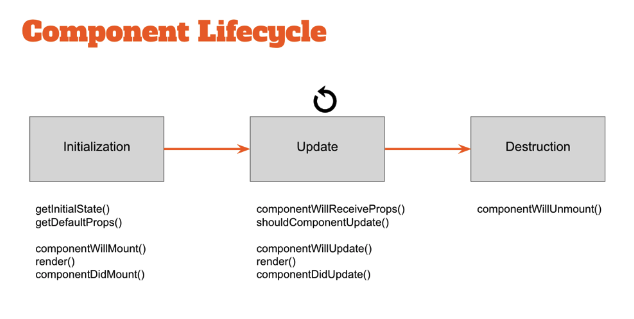

1. How does React work?
   - React creates a virtual DOM. When state changes in a component it firstly runs a "diffing" algorithm, which identifies what has changed in the virtual DOM. The second step is reconciliation, where it updates the DOM with the results of diff.
2. What is Context API in ReactJS ?

   - Context provides a way to pass data through the component tree without having to pass props down manually at every level. Context is designed to share data that can be considered “global” for a tree of React components, such as the current authenticated user, theme, or preferred language. Using context, we can avoid passing props through intermediate elements.

   ```js
   const ThemeContext = React.createContext("light");
   class App extends React.Component {
     render() {
       return (
         <ThemeContext.Provider value="dark">
           <Toolbar />
         </ThemeContext.Provider>
       );
     }
   }

   function Toolbar() {
     return (
       <div>
         <ThemedButton />
       </div>
     );
   }

   class ThemedButton extends React.Component {
     static contextType = ThemeContext;
     render() {
       return <Button theme={this.context} />;
     }
   }
   ```

3. What are props in React ?

   - Props are inputs to a React component. They are single values or objects containing a set of values that are passed to React Components on creation using a naming convention similar to HTML-tag attributes. i.e, They are data passed down from a parent component to a child component.

   - The primary purpose of props in React is to provide following component functionality:

   1. Pass custom data to your React component.
   2. Trigger state changes.
   3. Use via this.props.reactProp inside component's render() method.

   For example, let us create an element with reactProp property,

   ```jsx
   <Element reactProp="1" />
   ```

   This reactProp (or whatever you came up with) name then becomes a property attached to React's native props object which originally already exists on all components created using React library.

   ```jsx
   props.reactProp;
   ```

4. What is the use of refs ?

   - Refs provide a way to access DOM nodes or React elements created in the render method. They should be avoided in most cases, however, they can be useful when we need direct access to DOM element or an instance of a component.

   - There are a few good use cases for refs:

     1. Managing focus, text selection, or media playback.
     2. Triggering imperative animations.
     3. Integrating with third-party DOM libraries.

   - Refs are created using React.createRef() and attached to React elements via the ref attribute. Refs are commonly assigned to an instance property when a component is constructed so they can be referenced throughout the component.

     ```jsx
     class MyComponent extends React.Component {
       constructor(props) {
         super(props);
         this.myRef = React.createRef();
       }
       render() {
         return <div ref={this.myRef} />;
       }
     }
     ```

5. What are the advantages of ReactJS ?
   - Below are the advantages of ReactJS:
     1. Increases the application’s performance with Virtual DOM
     2. JSX makes code is easy to read and write
     3. It renders both on client and server side
     4. Easy to integrate with other frameworks (Angular, BackboneJS) since it is only a view library
     5. Easy to write UI Test cases and integration with tools such as JEST.
6. What are React Hooks ?
   - Hooks are a new addition in React 16.8. They let you use state and other React features without writing a class. With Hooks, you can extract stateful logic from a component so it can be tested independently and reused. Hooks allow you to reuse stateful logic without changing your component hierarchy. This makes it easy to share Hooks among many components or with the community.
7. How would you write an inline style in React ?
   - For example:
   ```jsx
   <div style={{ height: 10 }}>
   ```
8. What is React ?
   - React is an open-source JavaScript library created by Facebook for building complex, interactive UIs in web and mobile applications. React’s core purpose is to build UI components; it is often referred to as just the “V” (View) in an “MVC” architecture.
9. What are the major features of ReactJS ?
   - The major features of ReactJS are as follows,
     1. It uses VirtualDOM instead RealDOM considering that RealDOM manipulations are expensive.
     2. Supports server-side rendering
     3. Follows Unidirectional data flow or data binding
     4. Uses reusable/composable UI components to develop the view
10. What are the differences between a Class component and Functional component ?
    - Class Components
      1. Class-based Components uses ES6 class syntax. It can make use of the lifecycle methods.
      2. Class components extend from React.Component.
      3. In here you have to use this keyword to access the props and functions that you declare inside the class components.
    - Functional Components
      1. Functional Components are simpler comparing to class-based functions.
      2. Functional Components mainly focuses on the UI of the application, not on the behavior.
      3. To be more precise these are basically render function in the class component.
      4. Functional Components can have state and mimic lifecycle events using Reach Hooks
11. Whar are the advantages of using React ?
    - It is easy to know how a component is rendered, you just need to look at the render function.
    - JSX makes it easy to read the code of your components. It is also really easy to see the layout, or how components are plugged/combined with each other.
    - You can render React on the server-side with Nextjs. This enables improves SEO and performance.
    - It is easy to test.
    - You can use React with any framework (Backbone.js, Angular.js) as it only a view layer.
12. What is the differrence between state and props ?
    - The state is a data structure that starts with a default value when a Component mounts. It may be mutated across time, mostly as a result of user events.
    - Props (short for properties) are a Component's configuration. They are received from above and immutable as far as the Component receiving them is concerned. A Component cannot change its props, but it is responsible for putting together the props of its child Components. Props do not have to just be data - callback functions may be passed in as props.
13. What is the difference between a Presentational component and a Container component ?
    - Presentational components are concerned with how things look. They generally receive data and callbacks exclusively via props. These components rarely have their own state, but when they do it generally concerns UI state, as opposed to data state.
    - Container components are more concerned with how things work. These components provide the data and behavior to presentational or other container components. They call Flux actions and provide these as callbacks to the presentational components. They are also often stateful as they serve as data sources.
14. What are refs used for in React ?

    - Refs are an escape hatch which allow you to get direct access to a DOM element or an instance of a component. In order to use them you add a ref attribute to your component whose value is a callback function which will receive the underlying DOM element or the mounted instance of the component as its first argument.

    ```jsx
    class UnControlledForm extends Component {
      handleSubmit = () => {
        console.log("Input Value: ", this.input.value);
      };
      render() {
        return (
          <form onSubmit={this.handleSubmit}>
            <input type="text" ref={(input) => (this.input = input)} />
            <button type="submit">Submit</button>
          </form>
        );
      }
    }
    ```

    - Above notice that our input field has a ref attribute whose value is a function. That function receives the actual DOM element of input which we then put on the instance in order to have access to it inside of the handleSubmit function.
    - It’s often misconstrued that you need to use a class component in order to use refs, but refs can also be used with functional components by leveraging closures in JavaScript.

    ```jsx
    function CustomForm({ handleSubmit }) {
      let inputElement;
      return (
        <form onSubmit={() => handleSubmit(inputElement.value)}>
          <input type="text" ref={(input) => (inputElement = input)} />
          <button type="submit">Submit</button>
        </form>
      );
    }
    ```

15. What's the difference between a Controlled component and an Uncontrolled one in React ?

    - This relates to stateful DOM components (form elements) and the React docs explain the difference:
      1. A Controlled Component is one that takes its current value through props and notifies changes through callbacks like onChange. A parent component "controls" it by handling the callback and managing its own state and passing the new values as props to the controlled component. You could also call this a "dumb component".
      2. A Uncontrolled Component is one that stores its own state internally, and you query the DOM using a ref to find its current value when you need it. This is a bit more like traditional HTML.
    - Most native React form components support both controlled and uncontrolled usage:

    ```jsx
    // Controlled:
    <input type="text" value={value} onChange={handleChange} />

    // Uncontrolled:
    <input type="text" defaultValue="foo" ref={inputRef} />
    // Use `inputRef.current.value` to read the current value of <input>
    // In most (or all) cases you should use controlled components.
    ```

16. What are Controlled components in ReactJS ?
    - A Controlled Component is one that takes its current value through props and notifies changes through callbacks like onChange. A parent component "controls" it by handling the callback and managing its own state and passing the new values as props to the controlled component. You could also call this a "dumb component".
    ```jsx
    // Controlled:
    <input type="text" value={value} onChange={handleChange} />
    ```
17. What is state in React ?

    - State of a component is an object that holds some information that may change over the lifetime of the component. We should always try to make our state as simple as possible and minimize the number of stateful components.
    - Consider:

    ```jsx
    class User extends React.Component {
      constructor(props) {
        super(props);

        this.state = {
          message: "Welcome to React world",
        };
      }
      render() {
        return (
          <div>
            <h1>{this.state.message}</h1>
          </div>
        );
      }
    }
    ```

18. What does it mean for a component to be mounted in React ?
    - It has a corresponding element created in the DOM and is connected to that.
19. What are Fragments in React ?
    - It's common pattern in React which is used for a component to return multiple elements. Fragments let you group a list of children without adding extra nodes to the DOM.
    ```jsx
    render() {
        return (
            <React.Fragment>
            <ChildA />
            <ChildB />
            <ChildC />
            </React.Fragment>
        );
    }
    ```
    - There is also a shorter syntax:
    ```jsx
    render() {
        return (
        <>
            <ChildA />
            <ChildB />
            <ChildC />
        </>
        );
    }
    ```
20. When rendering a list what is a key and what is it's purpose ?
    - Keys help React identify which items have changed, are added, or are removed. Keys should be given to the elements inside the array to give the elements a stable identity. The best way to pick a key is to use a string that uniquely identifies a list item among its siblings.
    ```jsx
    render () {
        return (
            <ul>
            {this.state.todoItems.map(({task, uid}) => {
                return <li key={uid}>{task}</li>
            })}
            </ul>
        )
    }
    ```
    - Most often you would use IDs from your data as keys. When you don't have stable IDs for rendered items, you may use the item index as a key as a last resort. It is not recommend to use indexes for keys if the items can reorder, as that would be slow.
21. How to create refs in React ?
    - Refs are created using React.createRef() method and attached to React elements via the ref attribute. In order to use refs throughout the component, just assign the ref to the instance property with in constructor.
    ```jsx
    class MyComponent extends React.Component {
      constructor(props) {
        super(props);
        this.myRef = React.createRef();
      }
      render() {
        return <div ref={this.myRef} />;
      }
    }
    ```
    And:
    ```jsx
    class UserForm extends Component {
      handleSubmit = () => {
        console.log("Input Value is: ", this.input.value);
      };
      render() {
        return (
          <form onSubmit={this.handleSubmit}>
            <input type="text" ref={(input) => (this.input = input)} /> //
            Access DOM input in handle submit
            <button type="submit">Submit</button>
          </form>
        );
      }
    }
    ```
    We can also use it in functional components with the help of closures.
22. What is `useState()` in React ?

    - Explain what is the use of useState(0) there:

    ```jsx
    ...
    const [count, setCounter] = useState(0);
    const [moreStuff, setMoreStuff] = useState(...);
    ...

    const setCount = () => {
        setCounter(count + 1);
        setMoreStuff(...);
        ...
    };
    ```

    - `useState` is one of build-in react hooks. `useState(0)` returns a tuple where the first parameter count is the current state of the counter and setCounter is the method that will allow us to update the counter's state.
    - We can use the `setCounter` method to update the state of count anywhere - In this case we are using it inside of the setCount function where we can do more things; the idea with hooks is that we are able to keep our code more functional and avoid class based components if not desired/needed.

23. What are Stateful components in React ?

    - If the behaviour of a component is dependent on the state of the component then it can be termed as stateful component. These Stateful components are always class components and have a state that gets initialized in the constructor.

    ```jsx
    class App extends Component {
      constructor(props) {
        super(props);
        this.state = { count: 0 };
      }

      render() {
        // omitted for brevity
      }
    }
    ```

24. What is JSX ?
    - JSX is a syntax notation for Javascript XML (XML-like syntax extension to ECMAScript).It stands for JavaScript XML. It provides expressiveness of JavaScript along with HTML like template syntax. For example, the below text inside h1 tag return as javascript function to the render function,
    ```jsx
       render(){
    	return(
         <div>
            <h1> Welcome to React world!!</h1>
         </div>
    	);
     }
    ```
25. What are the limitations of React ?
    - Belows are the list of limitations:
      1. React is just a view library, not a full-blown framework
      2. There is a learning curve for beginners who are new to web development.
      3. Integrating React.js into a traditional MVC framework requires some additional configuration
      4. The code complexity increases with inline templating and JSX.
      5. Too many smaller components leading to over-engineering or boilerplate
26. What are Stateless components in React ?
    - If the behaviour is independent of its state then it can be a stateless component. You can use either a function or a class for creating stateless components. But unless you need to use a lifecycle hook in your components, you should go for stateless functional components.
    ```jsx
    // Stateful/Container/Smart component:
    class Main extends Component {
      constructor() {
        super();
        this.state = {
          books: [],
        };
      }
      render() {
        <BooksList books={this.state.books} />;
      }
    }
    // Stateless/Presentational/Dumb component:
    const BooksList = ({ books }) => {
      return (
        <ul>
          {books.map((book) => {
            return <li>book</li>;
          })}
        </ul>
      );
    };
    ```
    - There are a lot of benefits if you decide to use stateless functional components here; they are:
      1. easy to write, understand, and test, and
      2. you can avoid the this keyword altogether.
27. How is React different from AngularJS (1.x)?

    - For example, AngularJS (1.x) approaches building an application by extending HTML markup and injecting various constructs (e.g. Directives, Controllers, Services) at runtime. As a result, AngularJS is very opinionated about the greater architecture of your application — these abstractions are certainly useful in some cases, but they come at the cost of flexibility.

    - By contrast, React focuses exclusively on the creation of components, and has few (if any) opinions about an application’s architecture. This allows a developer an incredible amount of flexibility in choosing the architecture they deem “best” — though it also places the responsibility of choosing (or building) those parts on the developer.

28. What is the difference between state and props ?
    - Both props and state are plain JavaScript objects. While both of them hold information that influences the output of render, they are different in their functionality with respect to component. i.e,
      1. Props get passed to the component similar to function parameters
      2. State is managed within the component similar to variables declared within a function.
29. What are two types of components in ReactJS ?
    - There are two possible ways to create ReactJS Components.
      1. Functional components: This is the simplest way to create ReactJS components. It accepts props as an Object and returns ReactJS elements. We call it as “functional” because those are pure JavaScript functions.
      ```jsx
      function Greeting(props) {
        return <h1> Hello, {props.message}</h1>;
      }
      ```
      2. Class components: You can also use Es6 class to define component. The above functional component can be written as below,
      ```jsx
      class Greeting extends React.Component {
        render() {
          return <h1>Hello, {this.props.message}</h1>;
        }
      }
      ```
30. What is the purpose of callback function as an argument of setState ?
    - The callback function is invoked when setState finished and the component gets rendered. Since setState is asynchronous the callback function is used for any post action.
    - Note: It is recommended to use lifecycle method rather this callback function.
    ```jsx
    setState({ name: "sudheer" }, () =>
      console.log("The name has updated and component re-rendered")
    );
    ```
31. What are portals in React and when do we need them ?
    - Portals provide a first-class way to render children into a DOM node that exists outside the DOM hierarchy of the parent component.
    - Sometimes it’s useful to insert a child into a different location in the DOM:
    - A typical use case for portals is when a parent component has an overflow: hidden or z-index style, but you need the child to visually “break out” of its container.
    ```jsx
    render() {
    // React does *not* create a new div. It renders the children into `domNode`.
    // `domNode` is any valid DOM node, regardless of its location in the DOM.
    return ReactDOM.createPortal(
        this.props.children,
        domNode  );
    }
    ```
32. What are advantages of using React Hooks ?
    - Primarily, hooks in general enable the extraction and reuse of stateful logic that is common across multiple components without the burden of higher order components or render props. Hooks allow to easily manipulate the state of our functional component without needing to convert them into class components.
    - Hooks don’t work inside classes (because they let you use React without classes). By using them, we can totally avoid using lifecycle methods, such as componentDidMount, componentDidUpdate, componentWillUnmount. Instead, we will use built-in hooks like useEffect .
33. What happens during the lifecycle of a React component ?
    - At the highest level, React components have lifecycle events that fall into three general categories:
      1. Initialization
      2. State/Property Updates
      3. Destruction
    - 
34. What is the difference between Component and Container in Redux ?
    - Component is part of the React API. A Component is a class or function that describes part of a React UI.
    - Container is an informal term for a React component that is connected to a redux store. Containers receive Redux state updates and dispatch actions, and they usually don't render DOM elements; they delegate rendering to presentational child components.
35. What are inline conditional expressions in ReactJS ?
    - You can use either if statements or ternary expressions which are available from JS to conditionally render expressions. Apart from these approaches, you can also embed any expressions in JSX by wrapping them in curly braces and then followed by JS logical operator(&&).
    ```jsx
    if (this.state.mode === "view") {
      return <button onClick={this.handleEdit}>Edit</button>;
    } else {
      return <button onClick={this.handleSave}>Save</button>;
    }
    // or
    {
      view ? null : (
        <p>
          <input onChange={this.handleChange} value={this.state.inputText} />
        </p>
      );
    }
    ```
36. What is Reconciliation in ReactJS?
    - When a component’s props or state change, React decides whether an actual DOM update is necessary by comparing the newly returned element with the previously rendered one. When they are not equal, React will update the DOM. This process is called reconciliation.
37. What is the purpose of using `super` constructor with `props` argument in React?

    - A child class constructor cannot make use of this reference until `super()` method has been called. The same applies for ES6 sub-classes as well. The main reason of passing props parameter to `super()` call is to access `this.props` in your child constructors.

    ```jsx
    // passing props:
    class MyComponent extends React.Component {
      constructor(props) {
        super(props);
        console.log(this.props); // Prints { name: 'sudheer',age: 30 }
      }
    }
    // Not passing props:
    class MyComponent extends React.Component {
      constructor(props) {
        super();
        console.log(this.props); // Prints undefined
        // But Props parameter is still available
        console.log(props); // Prints { name: 'sudheer',age: 30 }
      }

      render() {
        // No difference outside constructor
        console.log(this.props); // Prints { name: 'sudheer',age: 30 }
      }
    }
    ```

    - The above code snippets reveals that this.props behavior is different only with in the constructor. It would be same outside the constructor.

38. What happens when you call setState ?
    - The first thing React will do when setState is called is merge the object you passed into setState into the current state of the component. This will kick off a process called reconciliation. The end goal of reconciliation is to, in the most efficient way possible, update the UI based on this new state.
    - To do this, React will construct a new tree of React elements (which you can think of as an object representation of your UI). Once it has this tree, in order to figure out how the UI should change in response to the new state, React will diff this new tree against the previous element tree.
    - By doing this, React will then know the exact changes which occurred, and by knowing exactly what changes occurred, will able to minimize its footprint on the UI by only making updates where absolutely necessary.
39. What is the difference between Element and Component in ReactJS?
    - An element is a plain object describing what you want to appear on the screen in terms of the DOM nodes or other components. Elements can contain other elements in their props. Creating a React element is cheap. Once an element is created, it is never mutated. The object representation of React element would be as follows,
    ```jsx
    const element = React.createElement("div", { id: "login-btn" }, "Login");
    ```
    - The above createElement returns as object as below,
    ```js
    {
        type: 'div',
        props: {
            children: 'Login',
            id: 'login-btn'
        }
    }
    ```
    - And finally it renders to the DOM using ReactDOM.render as below,
    ```jsx
    <div id="login-btn">Login</div>
    ```
    - Whereas a component can be declared in several different ways. It can be a class with a render() method. Alternatively, in simple cases, it can be defined as a function. In either case, it takes props as an input, and returns an element tree as the output. JSX transpiled as createElement at the end.
    ```jsx
    function Button({ onLogin }) {
      return React.createElement(
        "div",
        { id: "login-btn", onClick: onLogin },
        "Login"
      );
    }
    ```
40. What are Higher-Order Components (HOC) in React?
    - A higher-order component (HOC) is a function that takes a component and returns a new component. Basically, it’s a pattern that is derived from React’s compositional nature We call them as “pure’ components” because they can accept any dynamically provided child component but they won’t modify or copy any behavior from their input components.
    ```jsx
    const EnhancedComponent = higherOrderComponent(WrappedComponent);
    ```
    - HOC can be used for many use cases as below,
      1. Code reuse, logic and bootstrap abstraction
      2. Render High jacking
      3. State abstraction and manipulation
      4. Props manipulation
41. How to call loading function with React `useEffect` only once?

    - If you only want to run the function given to `useEffect` after the initial render, you can give it an empty array `[]` as the second argument.
    - For example:

    ```jsx
    function MyComponent() {
      useEffect(() => {
        loadDataOnlyOnce();
      }, []);

      return <div> {/*...*/} </div>;
    }
    ```

42. How to access DOM elements in React?

    - One of the useful application of the `useRef()` hook is to access DOM elements. This is performed in 3 steps:
      1. Define the reference to access the element `const elementRef = useRef()`;
      2. Assign the reference to `ref` attribute of the element: `<div ref={elementRef}></div>`;
      3. After mounting, `elementRef.current` points to the DOM element.
    - Consider:

    ```jsx
    import { useRef, useEffect } from "react";

    function AccessingElement() {
      const elementRef = useRef();

      useEffect(() => {
        const divElement = elementRef.current;
        console.log(divElement); // logs <div>I'm an element</div>
      }, []);

      return <div ref={elementRef}>I'm an element</div>;
    }
    ```

43. Name the different lifecycle methods for a class components.
    - Initialization: This is the stage where the component is constructed with the given Props and default state. This is done in the constructor of a Component Class.
    - Mounting: Mounting is the stage of rendering the JSX returned by the render method itself.
    - Updating: Updating is the stage when the state of a component is updated and the application is repainted.
    - Unmounting: As the name suggests Unmounting is the final step of the component lifecycle where the component is removed from the page.
44. What is `{this.props.children}` and when you should use it ?
    - `this.props.children` does is that it is used to display whatever you include between the opening and closing tags when invoking a component.
    - below it is example for the use case:
    ```jsx
    // children
    const Picture = (props) => {
    return (
        <div>
        
        {props.children}
        </div>
    )
    }
    // app.js
    render () {
    return (
        <div className='container'>
        <Picture key={picture.id} src={picture.src}>
            //what is placed here is passed as props.children
        </Picture>
        </div>
    )
    }
    ```
45. How would you prevent a component from rendering in React ?

    - Conditional Rendering: To create multiple components and render them based on some conditions. This is also a kind of encapsulation supported by React.
    - example:

    ```jsx
    const children = ({ name }) => {
      if (name === "") {
        return <div>Nothing</div>;
      }

      return (
        <div>
          <h1>{name}</h1>
        </div>
      );
    };
    ```

46. What's the typical pattern for rendering a list of components from an array in React?

    - The pattern for rendering a list of components from an array of data can be done by mapping all individual custom pieces of data to the component. With the map function, we will map every element data of the array to the custom components in a single line of code.
    - example code:

    ```jsx
    import React from "react";
    import List from "./components/List";

    function App() {
      const Users = [
        // Array of  students data
        {
          name: "Deepak",
          rollNo: "123",
        },
        {
          name: "Yash",
          rollNo: "124",
        },
      ];
      return (
        <div className="App">
          <h1>Rendering List of components with array of data</h1>
          {Users.map((user, index) => {
            return <List key={index} name={user.name} rollNo={user.rollNo} />;
          })}
        </div>
      );
    }

    export default App;
    ```

47. What are Pure Components ?
    - Pure Components in React are the components which do not re-renders when the value of state and props has been updated with the same values. If the value of the previous state or props and the new state or props is the same, the component is not re-rendered. Pure Components restricts the re-rendering ensuring the higher performance of the Component
      1. Prevents re-rendering of Component if props or state is the same
      2. Takes care of “shouldComponentUpdate” implicitly
      3. State and Props are Shallow Compared
      4. Pure Components are more performant in certain cases
48. What's the typical flow of data like in a React + Redux app ?
    - The flow of data in a React-Redux application begins at the component level when the user interacts with the application UI. This interaction leads to the action creators dispatching an action.
    - When an action is dispatched, it is received by the root reducer of the application and is passed on to all the reducers. Thus, it becomes the reducer’s task to determine if it needs to update the state based on the dispatched action.
    - This is checked by using a simple switch statement to filter out the required actions. Each (smaller) reducer in the application accepts the dispatched action and if the type of the dispatched action matches, it returns a newly updated state.
    - It is essential to note here that the state never actually changes in redux. Instead, the reducer always generates a new state which is a copy of the old state, but with some modifications.
    - The store then informs the component about the new state which in turn retrieves the updated state and re-renders the component.
    - Another important observation here is that flow of data in a React-Redux application is unidirectional, i.e., it only goes in one direction.
49. What are some limitations of things you shouldn't do in the component's render method in React ?
    - You cannot modify the component's state (with setState), nor interact with the browser (do that in componentDidMount). render should be a pure function.
50. How to bind methods or event handlers in JSX callbacks ?
    - Binding in Constructor: In JavaScript classes, the methods are not bound by default. The same thing applies for React event handlers defined as class methods. Normally we bind them in constructor.
    ```jsx
    class Component extends React.Component {
      constructor(props) {
        super(props);
        this.handleClick = this.handleClick.bind(this);
      }
      handleClick() {
        // ...
      }
    }
    ```
    - Public class fields syntax: If you don't like to use bind approach then public class fields syntax can be used to correctly bind callbacks.
    ```jsx
    handleClick = () => {
      console.log("this is:", this);
    };
    <button onClick={this.handleClick}>{"Click me"}</button>;
    ```
    - Arrow functions in callbacks: You can use arrow functions directly in the callbacks.
    ```jsx
    <button onClick={(event) => this.handleClick(event)}>{"Click me"}</button>
    ```
51. What is prop drilling and how can you avoid it ?
    - Anyone who has worked in React would have faced this and if not then will face it definitely. Prop drilling is basically a situation when the same data is being sent at almost every level due to requirements in the final level. Here is a diagram to demonstrate it better. Data needed to be sent from Parent to ChildC. In this article different ways to do that are discussed.
    - Design less nested child components instead of nested components and decrease props drilling issue or using context api in react, even using state management tools to avoid it.
52. What is the point of `shouldComponentUpdate()` method ?
    - The shouldComponentUpdate method allows us to exit the complex react update life cycle to avoid calling it again and again on every re-render. It only updates the component if the props passed to it changes.
    - The shouldComponentUpdate method is majorly used for optimizing the performance and to increase the responsiveness of the website but do not rely on it to prevent rendering as it may lead to bugs.
53. What are forward refs ?
    - The forwardRef method in React allows parent components to move down (or “forward”) refs to their children. ForwardRef gives a child component a reference to a DOM entity created by its parent component in React. This helps the child to read and modify the element from any location where it is used.
    - In React, parent components typically use props to transfer data down to their children. Consider you make a child component with a new set of props to change its behavior. We need a way to change the behavior of a child component without having to look for the state or re-rendering the component. We can do this by using refs. We can access a DOM node that is represented by an element using refs. As a result, we will make changes to it without affecting its state or having to re-render it.
    - When a child component needs to refer to its parent’s current node, the parent component must have a way for the child to receive its ref. The technique is known as ref forwarding.
    ```jsx
    React.forwardRef((props, ref) => {});
    ```
54. What do these three dots `(...)` in React do ?
    - That's property spread notation. It was added in ES2018 (spread for arrays/iterables was earlier, ES2015), but it's been supported in React projects for a long time via transpilation (as "JSX spread attributes" even though you could do it elsewhere, too, not just attributes).
    - {...this.props} spreads out the "own" enumerable properties in props as discrete properties on the Modal element you're creating. For instance, if this.props contained a: 1 and b: 2, then
    ```jsx
    <Modal {...this.props} title='Modal heading' animation={false}>
    ```
55. What are the lifecycle methods of ReactJS class components ?
    - `componentDidMount`:A lifecycle method runs or executes after the component is mounted and rendered to the DOM. It is called only once during the component's lifecycle after the component mounting is done.
    ```jsx
    import React from "react"
    class Users extends React.Component {
        state = {
            users: []
        }
        componentDidMount() {
            let responseData = [
                {id: 0, name: "Dishant"},
                {id: 1, name: "Dikshu"}
            ]
            this.setState({ users: responseData })
        }
        render() {
            return <>
        }
    }
    export default Users;
    ```
    - `componentDidUpdate`:It is a lifecycle method that executes after an update in the component and checks if a specific prop or state has changed.
    ```jsx
    import React from "react";
    class User extends React.Component {
      state = {
        userName: "",
      };
      componentDidUpdate(prevProps, prevState) {
        if (this.props.userName !== prevProps.userName) {
          this.setState({ userName: this.props.userName });
        }
      }
      render() {
        return <></>;
      }
    }
    ```
    - `componentWillUnmount`: It is a lifecycle method that runs or executes when component is about to be removed or unmounted from the DOM. It is called only once during the lifecycle of a component.
    ```jsx
    import React from "react";
    class User extends React.Component {
      state = {
        userName: "Dikshant",
      };
      componentWillUnmount() {
        this.setState({ userName: "" });
      }
      render() {
        return <></>;
      }
    }
    ```
56. What are the different phases of ReactJS component lifecycle ?
    - There are four pharse of ReactJS component lifecycle, such as Initializing, Mounting, Updating and Unmounting.
    - `Initializing`:This is the initial phase of the React component lifecycle. As the name suggests, this phase involves all the declarations, definitions, and initialization of properties, default props as well as the initial state of the component required by the developer.
    - `Mounting`:The second phase of the React component lifecycle, followed by the initialization phase, is the mounting phase. It commences when the component is positioned over the DOM container(meaning, an instance of the component is created and inserted into the DOM) and rendered on a webpage.
    - `Updating`:The third phase of the ReactJS Component Lifecycle is the Updation phase. Followed by the mounting phase, it updates the states and properties that were declared and initialized during the initialization phase (if at all any changes are required). It is also responsible for handling user interaction and passing data within the component hierarchy. Unlike the initialization phase, this phase can be repeated multiple times.
    - `Unmounting`:Unmounting is the last phase of the ReactJS component lifecycle. This phase includes those lifecycle methods which are used when a component is getting detached from the DOM container(meaning, the instance of the component being destroyed and unmounted from the DOM). It is also responsible for performing the required cleanup tasks. Once unmounted, a component can not be re-mounted again.
57. What is `Key` and benefit of using it in lists ?
    - Keys help React identify which items have changed (added/removed/re-ordered). To give a unique identity to every element inside the array, a key is required.
    - Prevent any UI bugs if there is updating list at rendering.
58. What's the difference between an Element and a Component in React ?
    - element has below attributes:
      1. An element is always gets returned by a component.
      2. The element does not have any methods.
      3. A React element is an object representation of a DOM node.
      4. Elements are immutable i,e once created cannot be changed.
      5. An element can be created using React.createElement( ) with type property.
      6. We cannot use React Hooks with elements as elements are immutable.
      7. Elements are light, stateless and hence it is faster.
    - Component has below attibutes:
      1. A component can be functional or a class that optionally takes input and returns an element.
      2. Each component has its life cycle methods.
      3. A component encapsulates a DOM tree.
      4. The state in a component is mutable.
      5. A component can be declared in different ways like it can be an element class with render() method or can be defined as a function.
      6. React hooks can be used with only functional components
      7. It is comparatively slower than elements.
59. What is the difference between ShadowDOM and VirtualDOM ?
    - Virtual DOM is creating a copy of the whole DOM object, and Shadow DOM creates small pieces of the DOM object which has their own, isolated scope for the element they represent.
60. Why do class methods need to be bound to a class instance ?
    - Due to javascript class is a type of function, and methods inside the function, it needs to initialize to `this` which means bind to `this` then to call inside the specified function.
    - And `this` actually is object under the hood, binding into it means a object to contain method for the class, it seems normal at javascript, of course at React as well.
61. What are Stateless components in React ?

    - Stateless components are those components which don’t have any state at all, which means you can’t use `this.setState` inside these components. It is like a normal function with no render method. It has no lifecycle, so it is not possible to use lifecycle methods such as componentDidMount and other hooks. When react renders our stateless component, all that it needs to do is just call the stateless component and pass down the props.

    ```jsx
    import React from "react";

    function Example(props) {
      return (
        <div>
          <p>{props.first_name}</p>
          <p>{props.last_name}</p>
        </div>
      );
    }
    export default Example;
    ```

62. What is children `prop` ?

    - The ability for components to receive and render children props is one of React’s most valuable features. It makes creating reusable components insanely simple. Simply encapsulate props.children with some markup or action and you’re done:

    ```jsx
    function House(props) {
      return <h2>I am a {props.children}!</h2>;
    }

    function Room() {
      return (
        <>
          <h1>Do you know my room number?</h1>
          <House type="duplex" />
        </>
      );
    }

    const Panel = (props) => <div className="Panel">{props.children}</div>;
    ```

63. Why React uses className over class attribute ?
    - The only reason behind the fact that it uses className over class is that the class is a reserved keyword in JavaScript and since we use JSX in React which itself is the extension of JavaScript, so we have to use className instead of class attribute. However, there are very less few scenarios where the DOM property for a given HTML attribute uses a different name. For example class as className. But nothing has changed with it, the semantic meaning of both className and class is the same, when JSX is rendered, the className attribute is automatically rendered as a class attribute.
64. What does `shouldComponentUpdate` do and why is it important?
    - Importance of shouldComponentUpdate():
    - It helps in checking whether the re-rendering of components is required or not. If the re-rendering is not required then shouldComponentUpdate do not render the component. For example, if we want our component to not render at some specific condition then shouldComponentUpdate can be of great use.
    - It helps in improving the performance.
    - It increases the responsiveness and optimization of the website
65. What is Lifting State Up in ReactJS ?
    - lifting state up means lifting state from one level to the next, without necessarily making the state global. That’s how I thought state management worked, since it is similar to variable, function and block scope.
    - The reason is that React approach will not pass the state to child component and mutation component at child component, it will pass entire logic which function down to child component to do the manipulation. In stead, Vue does other approach that pass state to child, mutate at child and will emit state back to parent to finish the manipulation.
66. Why we should not update `state` directly ?
    - One should never update the state directly because of the following reasons:
    - If you update it directly, calling the setState() afterward may just replace the update you made.
    - When you directly update the state, it does not change this.state immediately. Instead, it creates a pending state transition, and accessing it after calling this method will only return the present value.
    - You will lose control of the state across all components.
67. What's the difference between `useRef` and `createRef` ?
    - Since the createRef doesn’t persist the ref value on re-renders, we can see the ref.current value only once.
    - useRef is hook and createRef is function.
    - useRef uses same ref throughout and createRef creates new ref every time.
    - useRef save ref even re-render and createRef creates one instead.
    - useRef presists exist ref between re-render and createRef does not.
    - useRef uses in functional component, and createRef uses in class.
68. What is `StrictMode` in React ?
    - StrictMode is a React Developer Tool primarily used for highlighting possible problems in a web application. It activates additional deprecation checks and warnings for its child components. One of the reasons for its popularity is the fact that it provides visual feedback (warning/error messages) whenever the React guidelines and recommended practices are not followed.
    - The React StrictMode can be viewed as a helper component that allows developers to code efficiently and brings to their attention any suspicious code which might have been accidentally added to the application.
    - The StrictMode can be applied to any section of the application, not necessarily to the entire application. It is especially helpful to use while developing new codes or debugging the application.
69. What is the significance of `key` in ReactJS ?
    - Keys help React identify which items have changed, are added, or are removed. Keys should be given to the elements inside the array to give the elements a stable identity:
    ```jsx
    const numbers = [1, 2, 3, 4, 5];
    const listItems = numbers.map((number) => (
      <li key={number.toString()}>{number}</li>
    ));
    ```
70. What is the difference between `createElement` and `cloneElement` ?
    - createElement is the code that JSX gets compiled or converted into and is used by reacting to create elements and cloneElement is used for cloning elements and passing them new props.
    - createElement is used to describe how the User Interface looks and used to manipulate the elements.
    - createElement requires type, props, and children as arguments and cloneElement requires elements, props, and children as arguments.
    - createElement creates and returns a new element with the type as given in the arguments, cloneElement clones and returns a new element with the properties of a given element.
71. What would be the common mistake of function being called every time the component renders ?

    - You need to make sure that function is not being called while passing the function as a parameter.

    ```jsx
    render() {
    // Wrong: handleClick is called instead of passed as a reference!
    return <button onClick={this.handleClick()}>{'Click Me'}</button>
    }

    render() {
    // Correct: handleClick is passed as a reference!
    return <button onClick={this.handleClick}>{'Click Me'}</button>
    }
    ```

72. Are you familiar with Flux in the context of React ?
    - Flux is an “Application Architecture” (not a framework) built around one-way data flow using React Views, an Action Dispatcher, and Stores. The Flux pattern solves some major problems by embodying important principles of event control, which make React applications much easier to reason about, develop, and maintain.
73. What is the difference between HTML and React event handling ?
    - In HTML it specified event using `onclick`, `onsubmit`; In ReactJS it specified event using `onClick`, `onSubmite`;
    - In HTML it binds or provide string for the listener; In ReactJS it bind or provide entire function for the listener;
    - In HTML passing string inside the parenthesis; In ReactJS only pass method name instead;
    - In HTML can add event listener in any time; In ReactJS have to specify all the events at the time of creating the component;
74. What are Uncontrolled components ?
    - A Uncontrolled Component is one that stores its own state internally, and you query the DOM using a ref to find its current value when you need it. This is a bit more like traditional HTML.
    ```jsx
    <input type="text" defaultValue="foo" ref={inputRef} />
    ```
75. What are Error Boundaries in ReactJS ?

    - Error boundaries are React components that catch JavaScript errors anywhere in their child component tree, log those errors, and display a fallback UI instead of the component tree that crashed. Error boundaries catch errors during rendering, in lifecycle methods, and in constructors of the whole tree below them.

    ```jsx
    class ErrorBoundary extends React.Component {
      constructor(props) {
        super(props);
        this.state = { hasError: false };
      }

      static getDerivedStateFromError(error) {
        // Update state so the next render will show the fallback UI.
        return { hasError: true };
      }

      componentDidCatch(error, info) {
        // You can also log the error to an error reporting service
        logErrorToMyService(error, info);
      }

      render() {
        if (this.state.hasError) {
          // You can render any custom fallback UI
          return <h1>Something went wrong.</h1>;
        }

        return this.props.children;
      }
    }
    // use case
    <ErrorBoundary>
      <MyWidget />
    </ErrorBoundary>;
    ```

76. What's wrong with using Context in React ?
    - Everything that consumes a context re-renders everytime that context’s state changes.
    - That means that if you’re consuming your context all over the place in your app, or worse, using one context for your entire app’s state, it will cause a ton of re-renders in all the application.
77. What is Components Composition in React ?
    - React Composition is a development pattern based on React's original component model where we build components from other components using explicit defined `props` or the implicit `children` prop.
    - In terms of refactoring, React composition is a pattern that can be used to break a complex component down to smaller components, and then composing those smaller components to structure and complete your application.
78. What does Batching mean in ReactJS ?
    - Batching is a React feature that combines all the state updates into a single update, causing a single re-render thereby improving the performance of the app. In earlier versions of React, batching was only done for the event handlers.
79. What are the advantages of Batching in ReactJS ?
    - multiple state updates are batched as one state update and therefore trigger only one re-rendering of the component which improves the rendering performance especially for larger React applications.
80. Which lifecycle methods of class component is replaced by `useEffect` in functional component ?
    - `componentDidMount`, `componentDidUpdate`, `componentWillUnmont` replaced by `useEffect`.
81. Compare `useState` and `useReducer` implementations.
    - `useState` returns an array that holds the current state value and a `setStatemethod` for updating the state.
    ```jsx
    const [state, setState] = useState("default state");
    ```
    - `useReducer` returns an array that holds the current state value and a `dispatchmethod` that logically achieves the same goal as `setState`, updating the state.
    ```jsx
    const [state, dispatch] = useReducer(reducer, initialState);
    ```
82. Do React `Hooks` cover all use cases for class components ?
    - Yes, it cover by below hooks:
      1. `useEffect => componentDidMount, componentDidUpdate, componentWillMount`
      2. `useState => this.setState({})`
      3. `React.memo => shouldComponentUpdate`
83. How can I make use of Error Boundaries in functional React components ?

    - below example will show:

    ```jsx
    import * as React from "react";
    import ReactDOM from "react-dom";
    import { ErrorBoundary } from "react-error-boundary";

    function ErrorHandler({ error }) {
      return (
        <div role="alert">
          <p>An error occurred:</p>
          <pre>{error.message}</pre>
        </div>
      );
    }

    function City({ name }) {
      return <div>Hello, visit {name.toUpperCase()}</div>;
    }

    function Country({ capital }) {
      return <div>Hello, visit {capital.toUpperCase()}</div>;
    }

    function App() {
      return (
        <ErrorBoundary FallbackComponent={ErrorHandler}>
          <Country />
          <City />
        </ErrorBoundary>
      );
    }

    ReactDOM.render(<App />, document.getElementById("root"));
    ```

84. When would you use `useRef` ?
    - The useRef Hook allows you to persist values between renders. It can be used to store a mutable value that does not cause a re-render when updated. It can be used to access a DOM element directly.
85. How would you pass data from child to parent component in React ?

    - Following are the steps to pass data from child component to parent component:

      1. In the parent component, create a callback function. This callback function will retrieve the data from the child component.
      2. Pass the callback function to the child as a props from the parent component.
      3. The child component calls the parent callback function using props and passes the data to the parent component.

86. What is the purpose of `super(props)` ?

    - When you want to access this.props in constructor.

    ```jsx
    class MyComponent extends React.Component {
      constructor(props) {
        super(props);

        console.log(this.props);
        // -> { icon: 'home', … }
      }
    }
    ```

87. Explain the Virtual DOM concept in React.
    - The virtual DOM (VDOM) is a programming concept where an ideal, or “virtual”, representation of a UI is kept in memory and synced with the “real” DOM by a library such as ReactDOM.
    - This approach enables the declarative API of React: You tell React what state you want the UI to be in, and it makes sure the DOM matches that state. This abstracts out the attribute manipulation, event handling, and manual DOM updating that you would otherwise have to use to build your app.
    - Since “virtual DOM” is more of a pattern than a specific technology, people sometimes say it to mean different things. In React world, the term “virtual DOM” is usually associated with React elements since they are the objects representing the user interface. React, however, also uses internal objects called “fibers” to hold additional information about the component tree. They may also be considered a part of “virtual DOM” implementation in React.
88. Describe Flux vs MVC ?

    - MVC is well-known for its three-layer development architecture and it divides applications into three components:
      1. Model: Maintains the data and behavior of an application
      2. View: Displays the model in the UI
      3. Controller: Serves as an interface between view & model components
    - After learning a few highlights regarding the instability and complexity of the MVC architecture, the Facebook development team made some important changes in the system and released Flux as an alternative to MVC architecture. The Flux architecture is based on the following components:
      1. Store/ Stores: Serves as a container for the app state & logic
      2. Action: Enables data passing to the dispatcher
      3. View: Same as the view in MVC architecture, but in the context of React components
      4. Dispatcher – Coordinates actions & updates to stores

89. Can you force a React component to rerender without calling `setState` ?
    - In class components, you can call `this.forceUpdate()` to force a rerender.
    - In function components, there's no equivalent of `forceUpdate`, but you can contrive a way to force updates with the useState hook.
90. Why does React use `SyntheticEvents` ?
    - Cross browsers applications are easy to implement.
    - Synthetic events are that ReactJS reuses these events objects, by pooling them, which increase the performance.
91. How would you go about investigating slow React application rendering ?
    - You can use React Developer Tools to get a quick overview of what components re-render. Enable option "Highlight updates when components render".
    - Figure out what renders to fix： Not all renders are equal. Some are less performant than others. Don't try to fix every unnecessary render. Instead, find bottlenecks and fix them. React Developer Tools Profiler tab will help you with this.
92. What's a Pure Functional Component in React ?
    - A React component is considered pure if it renders the same output for the same state and props. For this type of class component, React provides the `PureComponent` base class. Class components that extend the `React.PureComponent` class are treated as pure components.
    - Pure components have some performance improvements and render optimizations since React implements the `shouldComponentUpdate()` method for them with a shallow comparison for props and state.
93. What is the second argument that can optionally be passed to setState and what is its purpose ?
    - The second argument that can optionally be passed to setState is a callback function which gets called immediately after the setState is completed and the components get re-rendered.
    - If you want your program to update the value of a state using setState and then perform certain actions on the updated value of state then you must specify those actions in a function which should be the second argument of the setState. If we would not do so then those actions will be performed on the previous value of state because of asynchronous nature of setState.
94. When is it important to pass props to `super()` and why ?
    - If you want to use this.props inside constructor, you need to pass it in super, otherwise it’s okay to not pass props to super as we see that irrespective of passing it to super, this.props is available inside render function.
95. Why would you need to bind event handler to `this` ?
    - When you are using class component and need to bind the method to function, and class is type of function to bind `this` to store the method in class.
96. What is the difference between using constructor vs `getInitialState` in React ?
    - The difference between constructor and getInitialState is the difference between ES6 and ES5 itself.
    - getInitialState is used with React.createClass and
      constructor is used with React.Component.
    ```jsx
    //ES5
    var TodoApp = React.createClass({
      propTypes: {
        title: PropTypes.string.isRequired,
      },
      getInitialState() {
        return {
          items: [],
        };
      },
    });
    ```
    ```jsx
    //ES6
    class TodoApp extends React.Component {
      constructor() {
        super();
        this.state = {
          items: [],
        };
      }
    }
    ```
97. Why doesn't `this.props.children.map` work ?
    - this.props.children is an opaque data structure. It can be either an array or a single element. In your case, this.props.children is probably a single element, which is why the .map() method is undefined.
    - should use the React.Children API when manipulating the children prop.
98. How to create Props Proxy for HOC component ?
    - You can add/edit props passed to the component using props proxy pattern like this:
    ```jsx
    function HOC(WrappedComponent) {
      return class Test extends Component {
        render() {
          const newProps = {
            title: "New Header",
            footer: false,
            showFeatureX: false,
            showFeatureY: true,
          };
          return <WrappedComponent {...this.props} {...newProps} />;
        }
      };
    }
    ```
99. How to conditionally add attributes to React components ?

    - Apparently, for certain attributes, React is intelligent enough to omit the attribute if the value you pass to it is not truthy. For example:

    ```jsx
    const InputComponent = function () {
      const required = true;
      const disabled = false;

      return <input type="text" disabled={disabled} required={required} />;
    };
    // will result in:
    <input type="text" required>
    ```

100. Does React re-render all components and sub components every time setState is called ?

- Yes.There is a method boolean shouldComponentUpdate(object nextProps, object nextState), each component has this method and it's responsible to determine "should component update (run render function)?" every time you change state or pass new props from parent component.
- You can write your own implementation of shouldComponentUpdate method for your component, but default implementation always returns true - meaning always re-run render function.

101. Describe how events are handled in React.

- example:
  ```jsx
  //html
  <button onclick="activateLasers()">
  Activate Lasers
  </button>
  // react
  <button onClick={activateLasers}>
  Activate Lasers
  </button>
  ```

102.  How to apply validation on `props` in ReactJS ?

- Need of Validating Props in React JS: Props are used to passing the read-only attributes to React components. For the proper functioning of components and to avoid future bugs and glitches it is necessary that props are passed correctly. Hence, it is required to use props validation for improving react component’s performance
- React JS has an inbuilt feature for validating props data type to make sure that values passed through props are valid. React components have a property called propTypes which is used to setup data type validation.

103.  When would you see use `StrictMode` component in React ?

- React `StrictMode` highlights potential problems in the application. By doing so, it helps you write more readable and safe applications. This feature is included in the React package, so you don’t have to import it separately. If you have any suspicious code, wrap it within the `StrictMode` helper component, and that’s it. Here’s how to use it in functional React components:

  ```jsx
  import React, { Component } from "react";
  function SuspiciousComponent() {
    return <div>Let's say this is suspicious</div>;
  }
  function App() {
    return (
      <div>
        <React.StrictMode>
          <SuspiciousComponent></SuspiciousComponent>
        </React.StrictMode>
      </div>
    );
  }
  ```

104.  What's the difference between `useCallback` and `useMemo` in practice ?

- Despite seeming very similar, there are different use cases for each. You should wrap functions with `useCallback` when passing a function as a dependency to other hooks or wrapping a functional component in `React.Memo()` that accepts your method as a property. You can use `useMemo` when you are working on functions where the inputs gradually change, where data values aren’t large enough to cause memory issues, or if the parameters are large enough so that the cost of comparison doesn’t outweigh the use of the wrapper
- `useCallback` works well in instances where the code would otherwise be recompiled with every call. Memorizing the results can decrease the cost of calling functions over and over again when the inputs change gradually over time.

105.  Explain why and when would you use `useMemo` ?

- `useMemo` is a React hook that memorizes the output of a function. That is it. `useMemo` accepts two arguments: a function and a list of dependencies. `useMemo` will call the function and return its return value. Then, every time you call `useMemo` again, it will first check if any dependencies have changed. If not, it will return the cached return value, not calling the function. If they have changed, `useMemo` will call the provided function again and repeat the process.
- Firstly, it is important to note that your code must not depend on `useMemo`. In other words, you should be able to replace `useMemo` calls with direct function calls and not change anything in the application behavior, except the performance. The easiest way to do it is to write code without `useMemo` first, then add as needed.

106.  When to use `useCallback`, `useMemo` and `useEffect` ?

- `useCallback`: Typically useCallback is helpful when passing callback props to highly optimised child components.

  1. For example, if a child component that accepts a callback relies on a referential equality check (eg: React.memo() or shouldComponentUpdate) to prevent unnecessary re-renders when its props change, then it is important that any callback props do not change between renders.

  - `useMemo`:
    1. When a component uses a value computed using a time-consuming function.
    2. Now consider another scenario when we have a component that does something when some data changes, for example, a let’s take the hook useEffect which logs if some dependency changes.
  - `useEffect`:
    1. hook is to execute code that needs happens during lifecycle of the component instead of on specific user interactions or DOM events.
    2. For instance, you wish to set a timer that executes a code when the component is rendered initially or as done in your initial example, the document title is updated when the component mounts, there is no user interaction associated here

107.  Can you do Components Inheritance in React ?

- If you want to use the parent's method inside children, you need to extend parent and call super in the constructor. super will run the constructor of the parent component. So, when you define or reference your method in the parent's constructor it can be accessible.

  ```jsx
  class A extends React.Component {
    constructor(props) {
      super(props);
      this.parentMethod = this.parentMethod.bind(this); //referencing the method in constructor
    }
    parentMethod() {
      console.log("Parent Method");
    }
    render() {
      return false;
    }
  }
  class B extends A {
    constructor() {
      super(); //call super to run parent's constructor
    }
    render() {
      this.parentMethod(); //calling parent method
      return false;
    }
  }
  ReactDOM.render(
    <div>
      <A />
      <B />
    </div>,
    document.getElementById("app")
  );
  ```

108.  What is difference between `Incremental DOM` and `Virtual DOM` ?

- `Virtual DOM` compares (diff) a new entire virtual DOM with the previous virtual DOM for changes then applies those changes to the actual DOM. - This approach creates a new virtual DOM to determine the changes (memory heavy).
- `Incremental DOM` has one virtual DOM and walks along the tree to find changes then mutates the virtual DOM and then apply those changes to the actual DOM - (reduced memory size and garbage collection).
- `Virtual DOM` - has a big memory footprint because it needs headroom for changes that "might" happen to the `virtual DOM`
- `Incremental DOM` - doesn’t need such a big footprint as memory is only allocated for changes.

109.  When would you use `flushSync` in ReactJS ?

- `flushSync` flushes the entire tree and actually forces complete re-rendering for updates that happen inside of a call, so you should use it very sparingly. This way it doesn’t break the guarantee of internal consistency between props, state, and refs.

110.  When shall we use `useReducer` hook in ReactJS ?

- The state value is an object or an array.
- When the logic to update state is super complex
- You need for a more predictable, and maintainable state architecture

111. When to use `useState` vs `useReducer` ?

- The state value is string, number, boolean just use `useState`, and use `useReducer` in object, array state.
- The logic of update state is simple use `useState`, if not then use `useReducer`.
- Use `useReducer` if need a more predictable, and maintainable state architecture. If not just use `useState`.

112.  How would you store non-state/instance variable in functional React components ?

- The useRef hook is not just for DOM refs, but can store any mutable value you like.

  ```jsx
  function FunctionalBar(props) {
    const [foo] = useState(new Animated.Value(0));
    const _foo = useRef(0);

    function showFoo() {
      let anim = Animated.timing(foo, {
        toValue: 1,
        duration: 1000,
        useNativeDriver: true,
      });
      anim.start(() => console.log(_foo.current));
    }

    useEffect(() => {
      function _onChangeFoo({ value }) {
        _foo.current = value;
      }

      foo.addListener(_onChangeFoo);
      showFoo();
      return () => foo.removeListener(_onChangeFoo);
    }, []);

    return <View />;
  }
  ```

113.  What is a Pure Function ?

- Pure functions take an input value (a parameter or argument) and depending on that input, produce an output value, that's all. They do one thing only, but they do it well.

- It should be that whenever you give a pure function the same input it will return the same output every single time.

  ```jsx
  const myPureFunction = number => return number * 4
  ```

114. Explain some difference between Flux and AngularJS(1.x) approach ?

- UI components in AngularJS typically rely on some internal `$scope` to store their data. This data can be directly mutated from within the UI component or anything given access to `$scope` - a risky situation for any part of the component or greater application which relies on that data.
- By contrast, the Flux pattern encourages the use of immutable data. Because the store is the central authority on all data, any mutations to that data must occur within the store. The risk of adata pollution is greatly reduced.

115. What is the key architectural difference between a JavaScript library such as React and a Javascript framework such as Angular ?

- Used as: ReactJS is JavaScript library updates the virtual DOM and Angular is a JavaScript framework updates the real DOM.
- Architecture: ReactJS is more simplified as MVC and Flux, and AngularJS is follow by MVVM.
- Preference: React.js is preferred when the dynamic content needed is intensive. Angular is platform-independent and hence is compatible to work in any platform.
- Dependency Injection: React.js Does not use the Dependency Injection concept, Angular Hierarchical Dependency Injection system used.

116. What is React Fiber ?

- React Fiber is a backwards compatible, complete rewrite of the React core. In other words, it is a reimplementation of older versions of the React reconciler.
- React Fiber is aimed at improving the perceived performance for complex React applications. It does so by allowing React to break the limits of the call stack. This lets it pause or start rendering work whenever required.
- React Fiber also increases the suitability of the React library to create animations, layouts, and gestures.
- Through its feature of incremental rendering, React Fiber lets developers split rendering work into smaller chunks and distribute it over multiple frames. This allows users to essentially control the "priority" of work.

117. How to avoid the need for binding in React ?

- To avoid the need for binding we have something introduced in ES6 as arrow functions. Using the arrow function to call this.setState will lead to avoid the use of bind. When we use the arrow function it works because of the of following reasons:
  1. It does not re-scope this, so we don’t need to bind this in the class constructor.
  2. JavaScript has first-class functions, which means functions are considered as data. Therefore, arrow functions can be assigned to class properties.

118. How does React renderer work exactly when we call `setState` ?

- Virtual DOM renders: when render method is called it returns a new virtual dom structure of the component. As I mentioned before, this render method is called always when you call setState(), because shouldComponentUpdate always returns true by default. So, by default, there is no optimization here in React.
- Native DOM renders: React changes real DOM nodes in your browser only if they were changed in the Virtual DOM and as little as needed - this is that great React's feature which optimizes real DOM mutation and makes React fast.

119. How to use `React.memo()` ?

- When deciding to update DOM, React first renders your component, then compares the result with the previous render. If the render results are different, React updates the DOM.
- Current vs previous render results comparison is fast. But you can speed up the process under some circumstances.
- When a component is wrapped in React.memo(), React renders the component and memoizes the result. Before the next render, if the new props are the same, React reuses the memoized result skipping the next rendering.
  ```jsx
  export function Movie({ title, releaseDate }) {
    return (
      <div>
        <div>Movie title: {title}</div>
        <div>Release date: {releaseDate}</div>
      </div>
    );
  }
  export const MemoizedMovie = React.memo(Movie);
  ```

120. Can a custom React hook return JSX ?

- When you write a hook that returns JSX component, you are essentially defining the component within the functional component, so on each and every re-render you will be creating a new instance of the component. This will lead to the component being unmounted and mounted again. Which is bad for performance and also buggy if you have stateful login within the component as the state will get reset with every re-render of parent
- By defining a JSX component within the hook, you are taking away the option of lazy loading your component if the need be.
- Any performance optimization to the component will require you to make use of useMemo which doesn't give you the flexibility of a custom comparator function like `React.memo`

121. What is the order of `useInsertionEffect`, `useEffect` and `useLayoutEffect` hooks at component generation ?

- `useInsertionEffect`: It fires synchronously before all DOM mutations. Use this to inject styles into the DOM before reading layout in `useLayoutEffect`. So it runs before `useLayoutEffect`.
- `useLayoutEffect`:It fires synchronously after all DOM mutations. Use this to read layout from the DOM and synchronously re-render.
- `useEffect`: It will run after the render is committed to the screen. So it runs after `useLayoutEffect`.
- The order:
  1. useInsertionEffect
  2. useLayoutEffect
  3. useEffect
