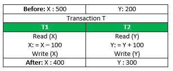
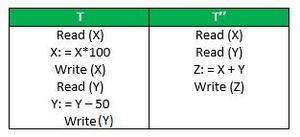

1. Define a Temp Table.

- In a nutshell, a temp table is a temporary storage structure. Basically, you can use a temp table to store data temporarily so you can manipulate and change it before it reaches its destination format.

2. What is a `VIEW` ?

- A view is simply a virtual table that is made up of elements of multiple physical or “real” tables. Views are most commonly used to join multiple tables together, or control access to any tables existing in background server processes.

3. What is `PRIMARY KEY` ?

- A `PRIMARY KEY` constraint is a unique identifier for a row within a database table.
- Every table should have a primary key constraint to uniquely identify each row and only one primary key constraint can be created for each table.
- The primary key constraints are used to enforce entity integrity.

4. What is Normalisation ?

- `Normalization` is basically to design a database schema such that `duplicate and redundant data is avoided`. If the same information is repeated in multiple places in the database, there is the risk that it is updated in one place but not the other, leading to data corruption.
- There is a number of normalization levels from 1. normal form through 5. normal form. Each normal form describes how to get rid of some specific problem.
- By having a database with normalization errors, you open the risk of getting invalid or corrupt data into the database. Since data "lives forever" it is very hard to get rid of corrupt data when first it has entered the database.

5. What is `DEFAULT` ?

- `Default` allows to add values to the column if the value of that column is not set.
- Default can be defined on number and datetime fields.
- They cannot be defined on timestamp and IDENTITY columns.

6. What is `FOREIGN KEY` ?

- `FOREIGN KEY` constraint prevents any actions that would destroy links between tables with the corresponding data values.
- A foreign key in one table points to a primary key in another table.
- Foreign keys prevent actions that would leave rows with foreign key values when there are no primary keys with that value.
- The foreign key constraints are used to `enforce referential integrity`.

7. What is the difference between `TRUNCATE` and `DELETE` ?

- `DELETE` is a Data Manipulation Language(DML) command. It can be used for deleting some specified rows from a table. `DELETE` command can be used with `WHERE` clause.
- `TRUNCATE` is a Data Definition Language(DDL) command. It deletes all the records of a particular table. `TRUNCATE` command is faster in comparison to `DELETE`. While `DELETE` command can be rolled back, `TRUNCATE` can not be rolled back in MySQL.

8. What is the difference between Data Definition Language (DDL) and Data Manipulation Language (DML) ?

- Data definition language (DDL) commands are the commands which are used to define the database. CREATE, ALTER, DROP and TRUNCATE are some common DDL commands.
- Data manipulation language (DML) commands are commands which are used for manipulation or modification of data. INSERT, UPDATE and DELETE are some common DML commands.

9. Define ACID Properties.

- `Atomicity`: by this, we mean that either the entire transaction takes place at once or doesn't happen at all. There is no midway i.e. transactions do not occur partially. Each transaction is considered as one unit and either runs to completion or is not executed at all. It involves the following two operations. 1. Abort: If a transaction aborts, changes made to the database are not visible. 2. Commit: If a transaction commits, changes made are visible.
  Atomicity is also known as the ‘All or nothing rule’.
  
  If the transaction fails after completion of T1 but before completion of T2.( say, after write(X) but before write(Y)), then the amount has been deducted from X but not added to Y. This results in an inconsistent database state. Therefore, the transaction must be executed in its entirety in order to ensure the correctness of the database state.
- `Consistency`:This means that integrity constraints must be maintained so that the database is consistent before and after the transaction. It refers to the correctness of a database. Referring to the example above,
  The total amount before and after the transaction must be maintained.
  Total before T occurs = 500 + 200 = 700.
  Total after T occurs = 400 + 300 = 700.
  Therefore, the database is consistent. Inconsistency occurs in case T1 completes but T2 fails. As a result, T is incomplete.
- `Isolation`:This property ensures that multiple transactions can occur concurrently without leading to the inconsistency of the database state. Transactions occur independently without interference. Changes occurring in a particular transaction will not be visible to any other transaction until that particular change in that transaction is written to memory or has been committed. This property ensures that the execution of transactions concurrently will result in a state that is equivalent to a state achieved these were executed serially in some order.
  Let X= 500, Y = 500.
  Consider two transactions T and T”.
  
  Suppose T has been executed till Read (Y) and then T’’ starts. As a result, interleaving of operations takes place due to which T’’ reads the correct value of X but the incorrect value of Y and sum computed by
  T’’: (X+Y = 50, 000+500=50, 500)
  is thus not consistent with the sum at end of the transaction:
  T: (X+Y = 50, 000 + 450 = 50, 450).
  This results in database inconsistency, due to a loss of 50 units. Hence, transactions must take place in isolation and changes should be visible only after they have been made to the main memory.
- `Durability`:
  This property ensures that once the transaction has completed execution, the updates and modifications to the database are stored in and written to disk and they persist even if a system failure occurs. These updates now become permanent and are stored in non-volatile memory. The effects of the transaction, thus, are never lost.

10. Discuss `INNER JOIN ON` vs `WHERE` clause (with multiple `FROM` tables).

- Yes. ON should be used to define the join condition and WHERE should be used to filter the data. I used the word should because this is not a hard rule. The splitting of these purposes with their respective clauses makes the query the most readable, it also prevents incorrect data being retrieved when using JOINs types other than INNER JOIN.

11. What is the difference between `INNER JOIN` and `OUTER JOIN` ?

- `Inner Join`:An inner join using either of the equivalent queries gives the intersection of the two tables, i.e. the two rows they have in common.

```sql
select * from a INNER JOIN b on a.a = b.b;
select a.*, b.*  from a,b where a.a = b.b;
a | b
--+--
3 | 3
4 | 4
```

- `Left outer join`:A left outer join will give all rows in A, plus any common rows in B.

```sql
select * from a LEFT OUTER JOIN b on a.a = b.b;
select a.*, b.*  from a,b where a.a = b.b(+);

a |  b
--+-----
1 | null
2 | null
3 |    3
4 |    4
```

- `Right outer join`: A right outer join will give all rows in B, plus any common rows in A.

```sql
select * from a RIGHT OUTER JOIN b on a.a = b.b;
select a.*, b.*  from a,b where a.a(+) = b.b;

a    |  b
-----+----
3    |  3
4    |  4
null |  5
null |  6
```

- `Full outer join`: A full outer join will give you the union of A and B, i.e. all the rows in A and all the rows in B. If something in A doesn't have a corresponding datum in B, then the B portion is null, and vice versa.

```sql
select * from a FULL OUTER JOIN b on a.a = b.b;

 a   |  b
-----+-----
   1 | null
   2 | null
   3 |    3
   4 |    4
null |    6
null |    5
```

12. What is the difference between `JOIN` and `UNION` ?

- `JOIN`:
  1. combines data from many tables based on a matched condition between them
  2. combines data into new columns.
  3. Number of columns selected from each table may not be same.
  4. Datatypes of corresponding columns selected from each table can be different.
  5. It may not return distinct columns.
- `UNION`:
  1. combines the result-set of two or more `SELECT` statements.
  2. combines data into new rows.
  3. Number of columns selected from each table should be same.
  4. Datatypes of corresponding columns selected from each table should be same.
  5. It returns distinct rows.

13. What is the difference between `UNION` and `UNION ALL` ?

- `Union`: means joining two or more data sets into a single set. In SQL Server, Union is used to combine two queries into a single result set using the select statements. Union extracts all the rows that are described in the query.
- `Union All`:A union is used for extracting rows using the conditions specified in the query while Union All is used for extracting all the rows from a set of two tables.
- The same conditions are applicable to Union All. The only difference between Union and Union All is that Union extracts the rows that are being specified in the query while Union All extracts all the rows including the duplicates (repeated values) from both the queries.

14. What is the difference between `INNER JOIN`, `OUTER JOIN`, `FULL OUTER JOIN` ?

- `INNER JOIN`:An inner join using either of the equivalent queries gives the intersection of the two tables, i.e. the two rows they have in common.
- `OUTER JOIN`: outer join includes left outer join and right outer join; A left outer join will give all rows in A, plus any common rows in B, A right outer join will give all rows in B, plus any common rows in A.
- `FULL OUTER JOIN`: A full outer join will give you the union of A and B, i.e. all the rows in A and all the rows in B. If something in A doesn't have a corresponding datum in B, then the B portion is null, and vice versa.

15. What is the difference between `WHERE` clause and `HAVING` clause ?

- `WHERE clause` is used to filter the records from the table or used while joining more than one table.Only those records will be extracted who are satisfying the specified condition in `WHERE clause`. It can be used with SELECT, UPDATE, DELETE statements.
- `HAVING Clause` is used to filter the records from the groups based on the given condition in the `HAVING Clause`. Those groups who will satisfy the given condition will appear in the final result. `HAVING Clause` can only be used
  with SELECT statement.

16. Describe the difference between truncate and delete.

- `DELETE` is a DML(Data Manipulation Language) command and is used when we specify the row(tuple) that we want to remove or delete from the table or relation. The `DELETE` command can contain a WHERE clause. If the WHERE clause is used with the `DELETE` command then it removes or deletes only those rows(tuple) that satisfy the condition otherwise by default it removes all the tuples(rows) from the table. Remember that `DELETE` logs the row deletions.

```sql
DELETE FROM TableName
WHERE condition;
```

- TRUNCATE is a DDL(Data Definition Language) command and is used to delete all the rows or tuples from a table. Unlike the DELETE command, the TRUNCATE command does not contain a WHERE clause. In the TRUNCATE command, the transaction log for each deleted data page is not recorded. Unlike the DELETE command, the TRUNCATE command is fast. We cannot roll back the data after using the TRUNCATE command.

```sql
TRUNCATE TABLE  TableName;The identity
```

17. What is Denormalization ?

- Denormalization is the process of adding precomputed redundant data to an otherwise normalized relational database to improve read performance of the database. Normalizing a database involves removing redundancy so only a single copy exists of each piece of information. Denormalizing a database requires data has first been normalized.
- With denormalization, the database administrator selectively adds back specific instances of redundant data after the data structure has been normalized. A denormalized database should not be confused with a database that has never been normalized.
- Using normalization in SQL, a database will store different but related types of data in separate logical tables, called relations. When a query combines data from multiple tables into a single result table, it is called a join. The performance of such a join in the face of complex queries is often the occasion for the administrator to explore the denormalization alternative.

18. What are the difference between Clustered and a Non-clustered index ?

- `Clustered Index` - Table is created with primary key constraints then database engine automatically create clustered index . In this data sort or store in the table or view based on their key and values.
- `Non-Clustered Index` - Table is created with UNIQUE constraints then database engine automatically create non-clustered index . A nonclustered index contains the nonclustered index key values and each key value entry has a pointer to the data row that contains the key value.

19. How does a Hash index work ?

- Hash indexes allow for quick lookups on data stored in tables. They work by creating an index key from the value and then locating it based on the resulting hash. It is useful when there is a lot of input with similar values or duplicates, as it only needs to compare keys instead of looking through all records.
- Hashing is taking a piece of information (a string) and turning it into an address or pointer for quick access later on.
- The idea with hashing is that data gets assigned a small number. When you’re looking up the data, you don’t have to actually sift through masses. Instead, just look up that one number. The simplest example is Ctrl+F-ing the word you’re looking for in a text instead of reading dozens of pages yourself.

20. How a database index can help performance ?

- An index is used to speed up data search and SQL query performance. The database indexes reduce the number of data pages that have to be read in order to find the specific record. The biggest challenge with indexing is to determine the right ones for each table.
